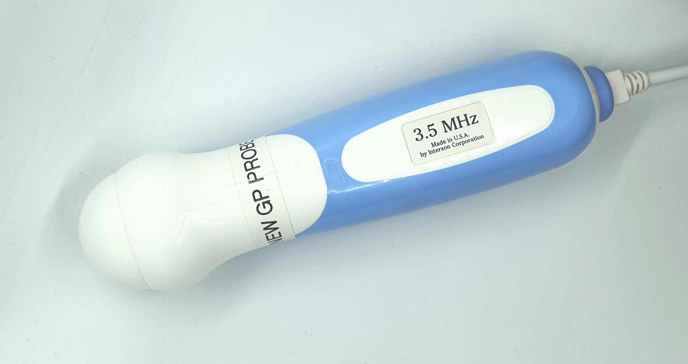
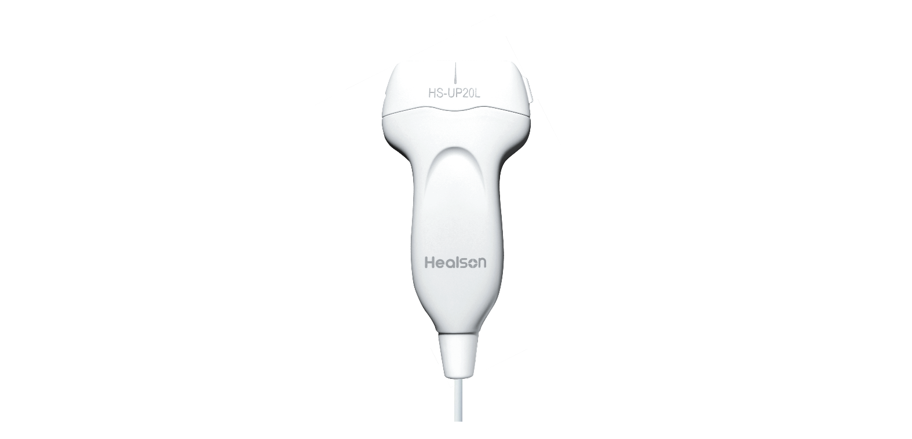

[](https://www.patreon.com/kelu124) 
[](https://ko-fi.com/G2G81MT0G)

[](https://join.slack.com/t/usdevkit/shared_invite/zt-2g501obl-z53YHyGOOMZjeCXuXzjZow)
[](http://commonmark.org)


# pyusbus Readme

## Objective

The objective for this lib is be able to get images from USB probes easily, under python, in a user-friendly API, getting images in 3 lines of code.

```python
import pyusbus as usbProbe
probe = usbProbe.UP20() 
frames = probe.getImages(n=10) # should give you a loop of 10 frames
```

It covers today four probes, including a mechanical one (interson), one convex, one linear bw, one linear doppler.

Not all features are identified / found back, as a work in progress, feel free to contribute or drop me a line if you want to explore a model.

## Result

First series on a vein phantom, second on my forearm. Still some work around image compression / dynamic range adjustments.
 


## Covered probes

So far, we do cover four probes.

```python
probe = usbProbe.Interson() 
probe = usbProbe.CONV() 
probe = usbProbe.UP20() 
probe = usbProbe.DOPPLER() 
```

### Interson probe



### BMV Convex 


### Linear HP20L



### BMV Doppler linear


## Installation

You can use the `build.sh` and `install.sh` scripts to prepare your module. Hopefully soon to come under pip.

# General setup
 
Need to work on the documentation here.

## Ubuntu adjustements

```
sudo usermod -a -G   $USER
sudo usermod -a -G dialout $USER
sudo echo "SUBSYSTEM==\"usb\", ATTR{idVendor}==\"04B4\", ATTR{idProduct}==\"8613\", MODE=\"666\"">/etc/udev/rules.d/99-healson.rules 
sudo echo "SUBSYSTEM==\"usb\", ATTR{idVendor}==\"04B4\", ATTR{idProduct}==\"0x00f1\", MODE=\"666\"">/etc/udev/rules.d/99-bmv.rules 
sudo echo "SUBSYSTEM==\"usb\", ATTR{idVendor}==\"1921\", ATTR{idProduct}==\"0001\", MODE=\"666\"">/etc/udev/rules.d/99-interson.rules 
sudo echo "SUBSYSTEM==\"usb\", ATTR{idVendor}==\"1921\", ATTR{idProduct}==\"f001\", MODE=\"666\"">/etc/udev/rules.d/99-interson-ok.rules 
sudo echo "SUBSYSTEM==\"usb\", ATTR{idVendor}==\"04B4\", ATTR{idProduct}==\"1003\", MODE=\"666\"">/etc/udev/rules.d/99-doppler.rules 
sudo udevadm control --reload-rules
```

For further debug, and to support wireshark checks on usbmon:

```
sudo modprobe usbmon
sudo setfacl -m u:$USER:r /dev/usbmon*
```

Note:


# Contents

* the `experiments` folder contains .. experiments.
  * [Initial Jupyter notebook](/experiments/20210325-UP20L_init.ipynb)
  * Init Convex

* the `pyusbus` folder contains the python API.


# Changelog

* v0.1.1:
  * Bug on doppler acquisitions, empty frames broke acquisitons
  * Adding tkinter tests for [doppler](experiments/20211030-DopplerGUI.py)

* v0.1.0:
  * Adding the Doppler BMV probe. B-Mode and Doppler modes seem to work.
  * Issues with `/etc/udev/rules.d for this probe.`. Actually was simple, another rule overrided this device descriptor.
  * Adding steering doppler data packets.

* v0.0.3:
  * Adding the interson probe. Loads of work remaining: so far getting images, but would be good to have some control over the actual width of the images (variable as of the motor speed). Some [pointers on interson's](https://github.com/KitwareMedical/IntersonManager/blob/master/IntersonManager.cpp) with Kitware, but unsure if that applies to this probe.
  * Interson: need to be able to read values with control read.

* v0.0.2:
  * Solved an issue with incomplete images with UP20
  * Adding a streamlit interface - to be improved.
  * (hopefully) solved a bug with base64.decode leading to incorrect padding. 

* v0.0.1: Inital release
  * Initial config. Works for UP20 probe, yielding enveloppe.
  * Also added a Convex probe, which yields RF signals.
  * Adding [Convex pictures of a phantom](/probes/CONV/)
  * saveImage added to UP20 with correct distance (mm) markers

# Todo

* __High priority__
  * Explore content of [arrays](/experiments/payloads/) for both UP20 and Convex. Support from users welcome ;)
  * Add correct ratios for images 
* __Medium__
  * Improve documentation
  * Better get the APIs different options
  * Get to know the Convex configuration packets
  * Explore acquisitions timings (packets/lines/frames per sec)
* __Low__
  * Add the module under pip

# License

```
    pyusbus is a python API to access usb ultrasound probes
    Copyright (C) 2021 Luc Jonveaux

    This program is free software: you can redistribute it and/or modify
    it under the terms of the GNU General Public License as published by
    the Free Software Foundation, either version 3 of the License, or
    (at your option) any later version.

    This program is distributed in the hope that it will be useful,
    but WITHOUT ANY WARRANTY; without even the implied warranty of
    MERCHANTABILITY or FITNESS FOR A PARTICULAR PURPOSE.  See the
    GNU General Public License for more details.

    You should have received a copy of the GNU General Public License
    along with this program.  If not, see <https://www.gnu.org/licenses/>.
```


