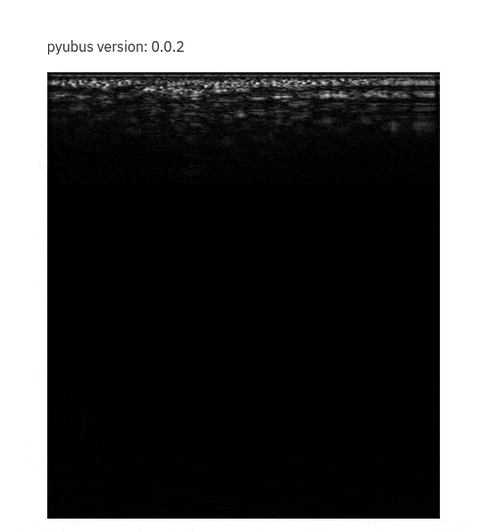

# Now faster with the linear probe!

Optimized code would look like:

```python
import streamlit as st
import pyusbus as usbProbe
import cv2

image_zone = st.empty()

probe = usbProbe.UP20()

while True: 
    img = probe.getImage()
    rgb = cv2.cvtColor(img, cv2.COLOR_GRAY2BGR)
    res = cv2.resize(rgb, dsize=(440, 500), interpolation=cv2.INTER_CUBIC)
    image_zone.image(res)
```

[See the full streamlit app](app.py).




